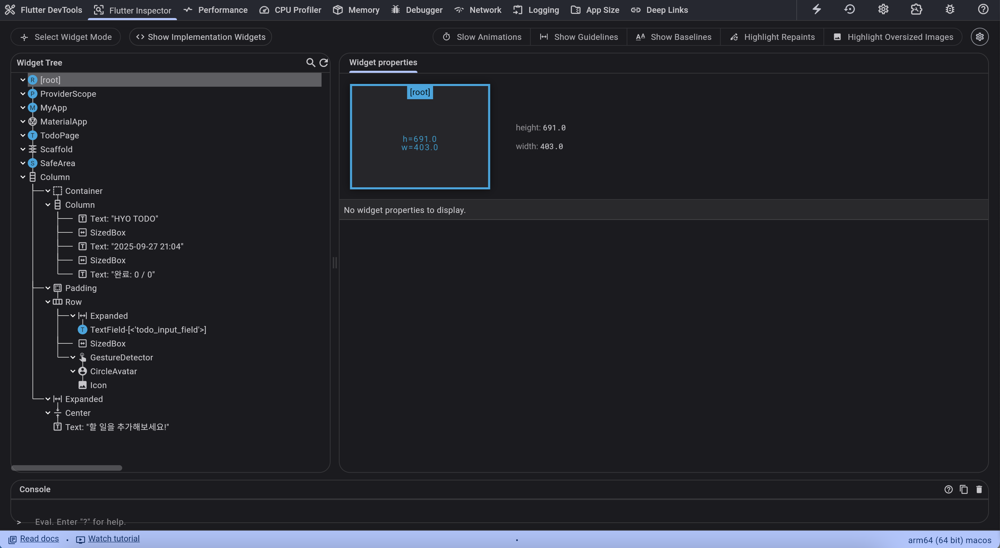
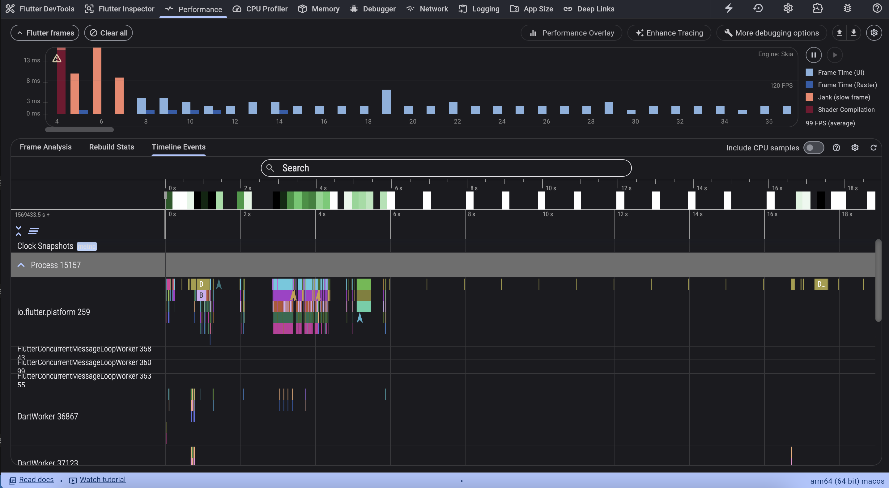
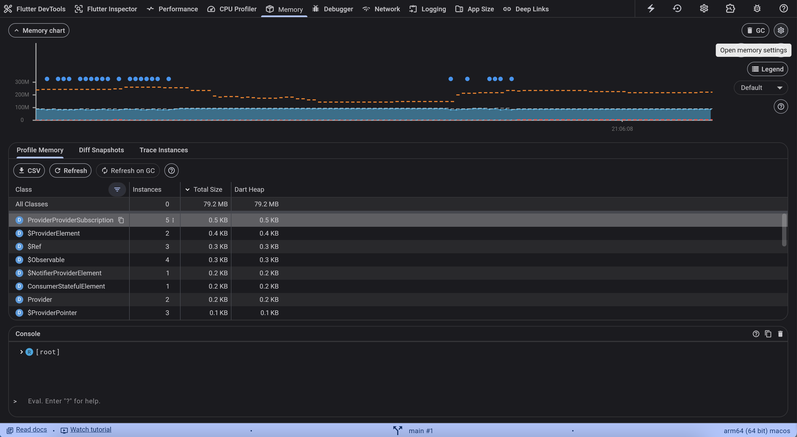
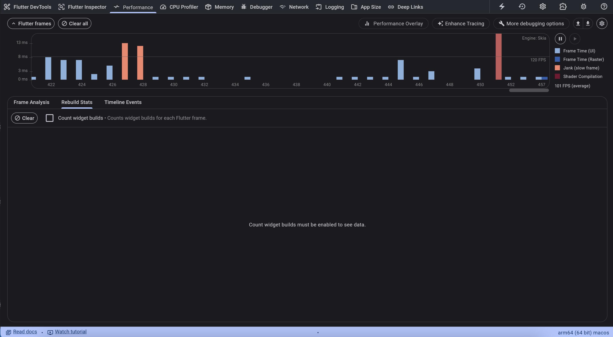

# HYO TODO - Flutter Web To Do App

## 빌드 및 실행 방법

### 실행 커맨드
flutter run -d chrome

## 코드 구조 설명

### 1. 프로젝트 구조
```
lib/
├── main.dart # 앱 진입점 및 UI
├── models/
│   └── todo.dart # Todo 모델 클래스
└── providers/
    └── todo_provider.dart # Riverpod 상태 관리
```

### 2. 사용된 위젯들
- **MaterialApp**: 앱의 전체적인 테마와 라우팅을 담당하는 루트 위젯
- **ConsumerStatefulWidget**: Riverpod과 연동해서 상태 변화를 감지하는 위젯
- **Scaffold**: 앱의 기본 구조(앱바, 바디, 플로팅 버튼 등)를 제공
- **SafeArea**: 화면의 안전 영역을 고려해서 콘텐츠를 배치
- **Container**: 할 일 개수 표시 부분의 배경색과 패딩을 설정
- **Column & Row**: 위젯들을 세로/가로로 배치하는 레이아웃 위젯
- **TextField**: 할 일을 입력받는 텍스트 입력 필드
- **GestureDetector & CircleAvatar**: 할 일 추가 버튼 (원형 + 아이콘)
- **ReorderableListView**: 드래그해서 순서를 바꿀 수 있는 리스트
- **Card & ListTile**: 각 할 일 항목을 표시하는 카드 형태의 UI
- **Checkbox**: 할 일 완료 여부를 체크하는 체크박스
- **IconButton**: 삭제 버튼
- **ReorderableDragStartListener**: 드래그 핸들 아이콘

### 3. 상태 자료구조
- **Todo 클래스**: 할 일 하나를 나타내는 모델 (id, task, done, created 필드)
- **List<Todo>**: 전체 할 일 목록을 저장하는 리스트
- **TodoNotifier**: 할 일 목록의 상태를 관리하는 Riverpod Notifier
- **Provider들**: 완료 개수, 전체 개수 등을 계산해서 제공하는 Provider들

### 4. 기능 구현
- **할 일 추가**: TextField에 입력하고 추가 버튼 혹은 엔터 누르면 새로운 Todo 생성
- **할 일 완료**: 체크박스 클릭하면 완료 상태가 바뀜 (취소선 생김)
- **할 일 삭제**: 삭제 버튼 누르면 해당 항목이 목록에서 사라짐
- **순서 변경**: 드래그 핸들을 잡고 끌어서 할 일 순서 바꾸기 가능
- **개수 표시**: 완료된 할 일 개수와 전체 개수를 실시간으로 보여줌
- **시간 표시**: 시간 표시 기능

## Bonus Points 구현 내용

### 1. Riverpod 사용
Flutter에서 상태 관리를 위해 Riverpod을 사용했습니다.

- **TodoNotifier**: 할 일 목록을 관리하는 클래스로, addTodo, toggleTodo, deleteTodo 등의 메서드가 있음
- **NotifierProvider**: TodoNotifier를 사용해서 할 일 목록 상태를 관리
- **Provider**: 완료 개수와 전체 개수를 자동으로 계산해서 제공
- **ConsumerStatefulWidget**: Riverpod의 상태 변화를 감지해서 UI를 업데이트하는 위젯
- **ref.watch()**: 상태를 감시해서 값이 바뀌면 자동으로 UI가 다시 그려짐
- **ref.read()**: 상태를 변경하는 액션을 실행할 때 사용

**사용한 Provider들:**
- 'todoProvider': 할 일 목록 전체를 관리
- 'doneCountProvider': 완료된 할 일 개수만 계산해서 제공
- 'totalCountProvider': 전체 할 일 개수를 계산해서 제공

### 2. DevTools 사용
Flutter DevTools를 사용해서 앱의 상태와 성능을 모니터링했습니다.

- **Flutter DevTools**
- **Provider Inspector**
- **Timeline**
- **Memory**
- **Performance**

## 스크린샷

### 기본 기능 스크린샷
1. **할 일 리스트 표시**

2. **할 일 추가**

3. **할 일 삭제**


### DevTools 스크린샷
1. **Inspector**

2. **Timeline**

3. **Memory**

4. **Performance**
